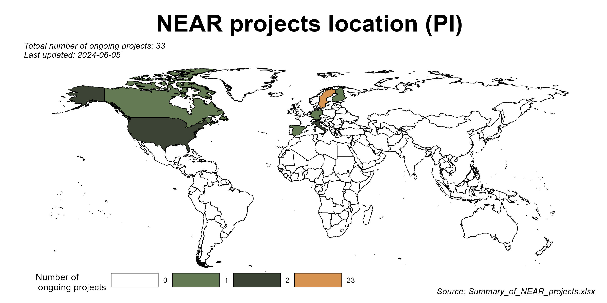
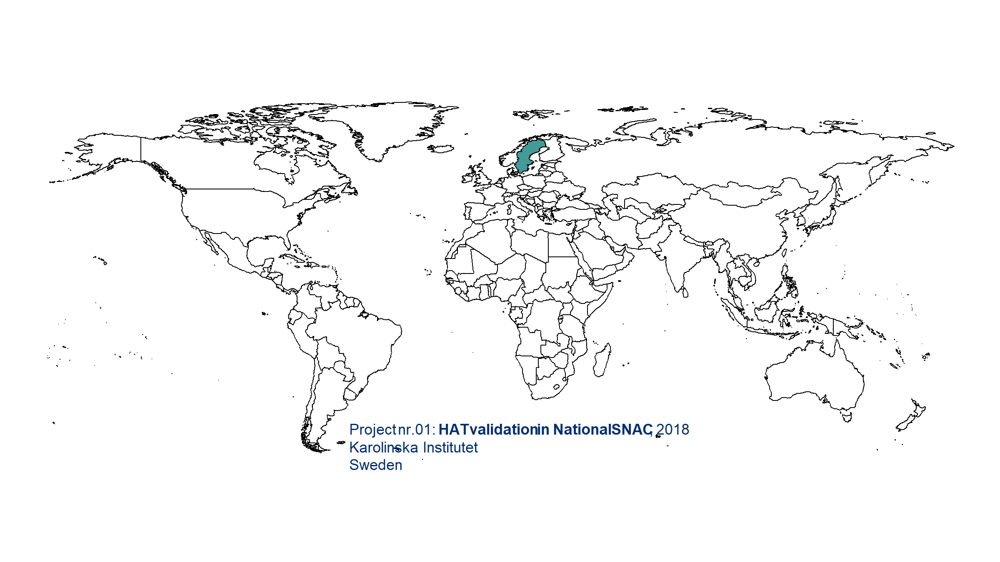

<!-- README.md is generated from README.Rmd. Please edit that file -->

```{r, include = FALSE}
knitr::opts_chunk$set(
  collapse = TRUE,
  comment = "#>",
  fig.path = "man/figures/README-",
  out.width = "100%",
  eval = FALSE
)
```

  <!-- badges: start -->
  [](https://github.com/Bolin-Wu/neartools/actions/workflows/R-CMD-check.yaml)
  [](https://app.codecov.io/gh/Bolin-Wu/neartools?branch=master)
  <!-- badges: end -->


  
<!-- -->

<!-- -->

# Motivation


There are many repetitive works when doing data harmonization and keeping track of communication with database managers and researchers.     

The goal of this package is to practice the "don't repeat yourself" (DRY) principle, making the daily work more handy.

# Installation

You can install the development version of neartools from [GitHub](https://github.com/) with:

``` r
# install.packages("devtools")
devtools::install_github("Bolin-Wu/neartools", force = TRUE)
```


# Example data

This package contains example data sets to test the functions.

```{r, eval=FALSE}
library(neartools)
# read data
fake_snack_df <- fake_snack_df
fake_caide_df <- fake_caide_df
df_dup_id <- df_dup_id
```


# R markdown templates

* `get_pretty_template`: Automatically create & open an rmd file with a nice looking template. This facilitates the communication with researchers & tracking the records. User can choose output file to be word", "pdf" or "html". By default it complies an "word" file. 

```{r}
# create & open a rmd file
get_pretty_template(
  subDir = "Enquiry/db",
  name = "Data_inspection_db",
  output_file = "word"
)
```


# Data inspection

* `get_label_df`: Get the labels of a data frame. By filtering on the result, the users can quickly select the interested variables and check their missing value percentages.

```{r}
# get the label of SPSS and STATA files imported in R
label_df <- get_label_df(df_w_label = fake_snack_df)
```

* `get_date_digit`: Inspect date in numeric digit form. Filter dates not having required form.

```{r}
# get the date digits and find wrong ones
get_date_digit(
  df_arg = fake_snack_df,
  id_string = "Lop",
  date_string = "numeric_date",
  required_digits = 8,
  required_leading_num = 1
)
```

* `get_all_colnames`: Gather multiple data files and examine their columns' names, labels and missing value percentages together.

```{r}
# get columns of all interested data files
df_files <- c("fake_snack_df", "fake_caide_df")
get_all_colnames(df_name = df_files)
```

* `get_dup_id`: Check existence of ID duplication and pinpoint them.

```{r }
# check ID duplication
get_dup_id(df = df_dup_id, id_str = "id")
```

* `get_diff_cols`: Compare the two records with the same ID, find the columns with different values.
  * It is useful for deciding which row to keep when we find there are duplicated IDs (e.g. after using `get_dup_id()`).  
  * This function conquers the problem 'NA' values when comparing the columns. Most available functions by default returns 'NA' as long as there is any missing value in the columns. However, we also want to know the columns that one record gives "NA" and the other has values.

```{r }
# find duplicared IDs
dup_id <- get_dup_id(df = df_dup_id, id_str = "id")$replicated_id

get_diff_cols(data = df_dup_id, id_str = "id", id_num = dup_id[1])
```

# Data manipulation

* `get_unique_join`: Joins multiple tibbles and generates unique columns to record non-NA values when there are identical column names.

```{r}
get_unique_join(tibble_names = c("fake_snacn_ph_wave3", "fake_snacn_ph_fu"),
               join_type = "full_join",
               by_cols = "Lopnr == N1lopnr, age")
```


# Data import and export

* `export_sav_to_csv`: Convert all the SPSS data files (*.sav*) to csv files. This conversion is needed because the maelstrom harmonization package does not read *.sav* data. This function can prevent repetitive work of converting *.sav* to *.csv* one by one. 

```{r}
# convert SPSS files
export_sav_to_csv("original_data", "SNAC-K")
```


* `import_bulk`: Bulk import SPSS, STATA, rds, Rdata and MS Excel files to R global environment. 


```{r }
# bulk import
db_dir <- here("data", "raw", "SNAC-K")
# this import all csv, sav and dta files in the 'db_dir'
import_bulk(data_dir = db_dir)
# this import only a specific type files
import_bulk(data_dir = db_dir, file_type = "sav")
```


* *To be continued....*

# Changelog 

Please check [NEWS.md](https://github.com/Bolin-Wu/neartools/blob/master/NEWS.md) for history updates.
