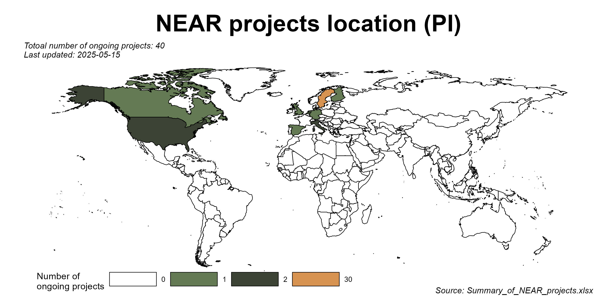

<!-- README.md is generated from README.Rmd. Please edit that file -->

<!-- badges: start -->
[](https://github.com/Bolin-Wu/neartools/actions/workflows/R-CMD-check.yaml)
[](https://app.codecov.io/gh/Bolin-Wu/neartools?branch=master)
<!-- badges: end -->

<!-- -->

# Motivation

There are many repetitive works when doing data harmonization and
keeping track of communication with researchers.

The goal of this package is to practice the “don’t repeat yourself”
(DRY) principle, making the daily work more handy.

# Functions

This package contains functions as follows:

-   `get_label_df`: Get the labels from a dataframe.

-   `get_pretty_template`: Automatically create an ‘rmd’ folder, create
    & open an rmd file with a nice looking template. This facilitates
    the communication with researchers & tracking the records. By
    default it complies an *html* file.  
    For more information about R markdown please see
    [here](https://rmarkdown.rstudio.com).

-   `fix_dup_id`: Check the ID duplication. It gives a list with
    examination results.

    -   If a dataframe has replicated IDs or not. If yes:
    -   Specific replicated ID. May need to report them to local DBM to
        double check those IDs.
    -   A new distinct ID. E.g, for both people with ID = 2, the new ID
        are 2.0, 2.1, etc. It is appended before original ID column.
        **This new ID creation is not a recommended solution.** It is
        just a temporary instrument for further other works,
        e.g. importing data to SQL database.

-   `export_sav_to_csv`: Convert all the SPSS data files (*.sav*) to csv
    files. This conversion is needed because the maelstrom harmonization
    package does not read *.sav* data. This function can prevent
    repetitive work of converting *.sav* to *.csv* one by one.

-   `import_bulk`: Bulk import SPSS, STATA and MS Excel files in a
    folder to R global environment.

-   *To be continued….*

## Installation

You can install the development version of neartools from
[GitHub](https://github.com/) with:

``` r
# install.packages("devtools")
devtools::install_github("Bolin-Wu/neartools", force = TRUE)
```

## Example

``` r
# load the package
library(neartools)

# get the label from SPSS and STATA file in
get_label_df(df_w_label = fake_snack_df)

# initiate a rmd file 
get_pretty_template(name = "Reply to Prof XXX", output_file = "word")

# check ID duplication
fix_dup_id(df = baseline_example_Relative_220504, id_str = "lopnr")

# convert SPSS files
sav_to_csv("original_data", "SNAC-K")

# data import
db_dir <- here("data", "raw","SNAC-K")
# this import all csv, sav and dta files in the 'db_dir'
import_bulk(data_dir = db_dir)
# this import only a specific type files
import_bulk(data_dir = db_dir, file_type = 'sav')
```
