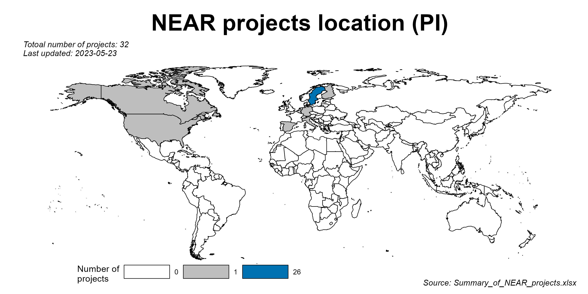
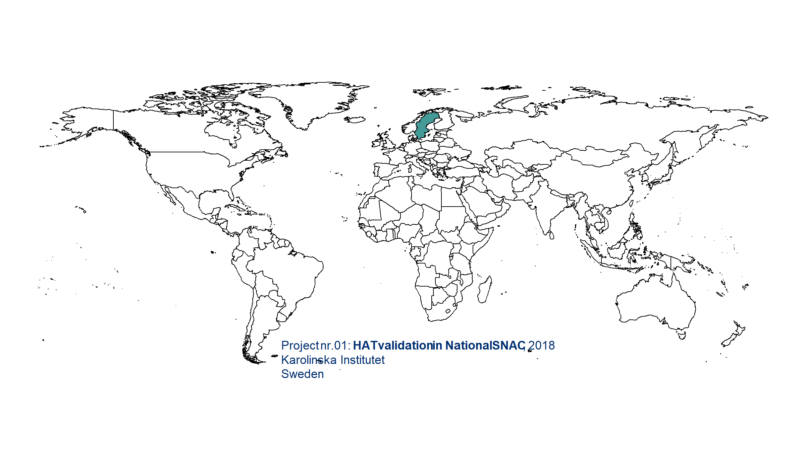

[](https://github.com/Bolin-Wu/neartools/actions/workflows/R-CMD-check.yaml)





## Installation

You can install the development version of `neartools` from
[GitHub](https://github.com/Bolin-Wu/neartools) with:

``` r
# install.packages("devtools")
devtools::install_github("Bolin-Wu/neartools", force = TRUE)
```

## Core Functionality

1.  Data Exploration & Variable Discovery Quickly locate variables or
    examine column metadata across multiple datasets in your global
    environment.

``` r
library(neartools)

# Load example data into Global Environment
data("fake_snacn_ph_fu")
data("fake_snacn_ph_wave3")

# Search for variables starting with 'ph' across SNAC-N datasets
get_vars_by_pattern(data_pattern = "^fake_snacn_ph", var_pattern = "^ph")

# Get comprehensive column metadata (labels, NA percentages, etc.)
get_all_colnames(df_name = c("fake_snacn_ph_fu", "fake_snacn_ph_wave3"))
```

2.  Bulk Data Import & Export Manage multiple files simultaneously,
    including specialized conversions for SPSS data.

``` r
# Import all supported files in a folder
import_bulk(data_dir = "path/to/data", file_type = "all")

# Convert all .sav (SPSS) files in a directory to .csv
export_sav_to_csv(target_dir = "path/to/spss_files")
```

3.  Data Cleaning Utilities Standardize and clean data frames with
    specialized utility functions:

- Uniqueness Checks:
  [`get_unique_join()`](https://bolin-wu.github.io/neartools/reference/get_unique_join.md)
  performs joins while ensuring uniqueness to prevent row inflation.
- Missing Values:
  [`fix_empty_string()`](https://bolin-wu.github.io/neartools/reference/fix_empty_string.md)
  converts empty strings to NA across a dataframe.
- Date Parsing:
  [`get_date_digit()`](https://bolin-wu.github.io/neartools/reference/get_date_digit.md)
  extracts standardized date components from numeric strings.
- Label Management:
  [`get_label_df()`](https://bolin-wu.github.io/neartools/reference/get_label_df.md)
  creates a tidy tibble of variable labels and types.

## Template Generation

Generate standardized R Markdown templates for HTML, PDF, or Word
reports:

``` r
get_pretty_template(type = "html", output_dir = "reports")
```

## Changelog

Please check
[NEWS.md](https://github.com/Bolin-Wu/neartools/blob/master/NEWS.md) for
history updates.
